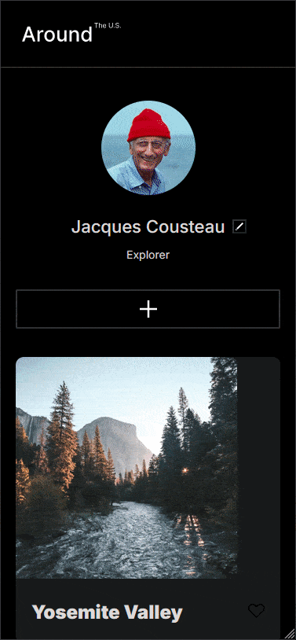

# Project 3: Around The U.S.

### Overview  

  
**Intro**
  
This project is made so all the elements are displayed correctly on popular screen sizes. We recommend investing more time in completing this project, since it's more difficult than previous ones.  

The follolwing tools were used to implement this project:

* Figma
* HTML  
* CSS  

**Figma**  
  
* [Link to the project on Figma](https://www.figma.com/file/ii4xxsJ0ghevUOcssTlHZv/Sprint-3%3A-Around-the-US?node-id=0%3A1)  

**Github Pages**  

* [Link to the project on Github Pages](https://untraceabledev.github.io/se_project_aroundtheus/)  

**GIFs**  

Posted below are gifs that show how the webpage respodns to different screen sizes.

###### Desktop

###### Tablet

###### Mobile

